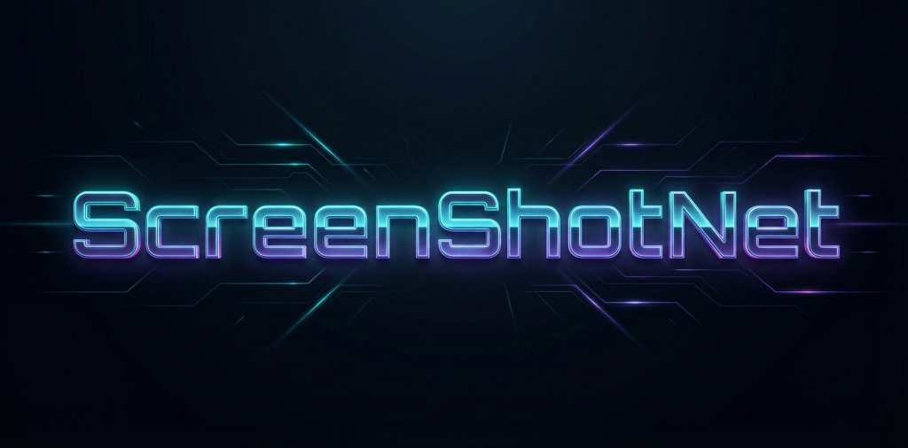

# ScreenShotNet

<!-- markdownlint-disable MD033 -->
<p align="center">
  
</p>

<p align="center">
  <a href="https://x.com/tobitege">
    
  </a>
</p>

<p align="center">
ScreenShotNet captures scripted rectangular screenshots. MIT licensed.
</p>
<!-- markdownlint-enable MD033 -->

## Usage

```ps
ScreenShotNet --region <x,y,width,height> [--delay <seconds>] [--clipboard] [--file <path>] [--format <png|jpg|bmp|gif|tiff>] [--watermark-text <text> --watermark-pos <x,y> --watermark-size <size> --watermark-color <color>]
```

Placeholder notes:

- '<...>' means replace this with your value. Do not type '<' or '>'.
- '[...]' means optional.

## Skill

The repo includes a reusable skill file here:

- [skills/ScreenShotNet/SKILL.md](skills/ScreenShotNet/SKILL.md)

In plain terms, this skill is a ready-made instruction sheet for AI assistants. It tells the assistant when to use ScreenShotNet, which command shape is valid, and what to report back.

Usual installation process (example for Cursor):

1. Copy the skills/ScreenShotNet folder into your Cursor skills directory (for example: %USERPROFILE%\\.cursor\skills\ScreenShotNet).
2. Reload/restart Cursor so the new skill is picked up.
3. Ask the assistant to use the ScreenShotNet skill when doing screenshot tasks.

This requires that the tool has been built already and the skill might need editing for correct paths!

## Shell quoting rules (PowerShell and CMD)

- No quotes needed for simple values, for example: --region 0,0,400,300 --delay 1.5 --format jpg
- If a value contains spaces, wrap it in double quotes.
- In cmd.exe, single quotes do not quote values. Use double quotes only.
- In PowerShell, both quote styles work, but double quotes are used in this README for consistency.

Examples:

- PowerShell: ScreenShotNet --file "C:\temp\my capture.jpg" --watermark-text "Draft Build" --region 0,0,400,300
- cmd.exe:    ScreenShotNet --file "C:\temp\my capture.jpg" --watermark-text "Draft Build" --region 0,0,400,300

## Options

- -r, --region: required capture rectangle (x,y,width,height)
- -d, --delay: optional delay in seconds (default 0)
- -c, --clipboard: output screenshot to clipboard (can be combined with --file)
- -f, --file: output screenshot to file (adds .png if extension is missing; format inferred from extension if present)
- --format: explicit file format override (png, jpg, bmp, gif, tiff; requires --file)
- --watermark-text: optional watermark text to draw
- --watermark-pos: watermark text position in capture-local pixels (x,y)
- --watermark-size: watermark font size in points (default 24)
- --watermark-color: watermark color (#RRGGBB, #AARRGGBB, or known color name)
- -h, --help: show help and examples

## Examples

- ScreenShotNet --region 0,0,400,300 --clipboard
- ScreenShotNet --region 100,100,640,480 --delay 1.5 --file .\out\capture.png
- ScreenShotNet --region 100,100,640,480 --file .\out\capture --format jpg
- ScreenShotNet --region 100,100,640,480 --file "D:\temp\my capture.jpg" --format jpg
- ScreenShotNet --region 100,100,640,480 --clipboard --file .\out\capture.png
- ScreenShotNet --region 50,50,500,300 --watermark-text "Draft" --watermark-pos 12,24 --watermark-size 18 --watermark-color "#80FF0000" --file .\out\capture-watermark.png

## Exit codes

- 0: success
- 2: invalid arguments or validation failure
- 3: runtime capture/output failure

## Building

- Default build target is net48 for maximum compatibility.
- Enable modern targets (net9.0-windows, net10.0-windows, net11.0-windows) with:
  - dotnet build -p:EnableModernTfms=true
  - pwsh .\scripts\build_desktop.ps1 -EnableModernTfms
